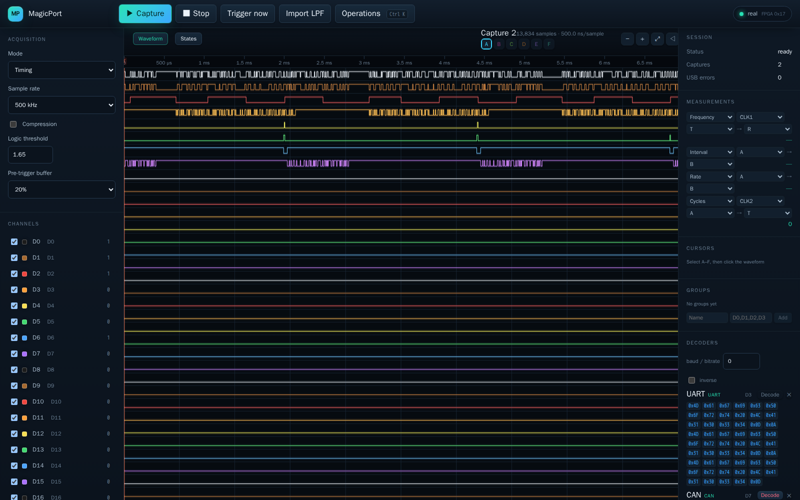

# LogicPort

Open-source Linux software for the Intronix LogicPort LA1034 USB logic
analyzer. It turns the analyzer into a service that both people and AI agents
can drive: a modern web dashboard for humans, and an equal-fidelity MCP and REST
API for agents. Everything runs in Docker.

The LA1034 is a 34-channel analyzer (32 data lines D0–D31 plus two clocks,
CLK1/CLK2) that samples at up to 500 MHz. This project provides a daemon that
configures the device, runs acquisitions, reconstructs the captured samples, and
decodes common bus protocols — all exposed through one operation set that is
identical across the web UI, REST, and MCP.



## Highlights

- **Web dashboard** (React + WebGL2): live auto-refreshing timeline, glowing
  per-channel traces, a movable measurement cursor, capture history, and
  `.LPF` project import.
- **Agent-first**: every operation available in the UI is also an MCP tool and a
  REST endpoint, so an agent can do anything a person can.
- **Timing and state capture**, RLE compression with exact reconstruction, and
  seven protocol decoders (async serial, SPI, I²C, CAN 2.0A/B, 1-Wire,
  ISO 7816-3, and parallel/quad-SPI).
- **Robust transport**: the daemon recovers from transient USB faults on its own
  and clearly reports when a device needs to be re-plugged.
- **Reproducible**: the whole stack builds and tests in Docker with no host
  toolchain.

## Hardware

- **Required**: an Intronix LogicPort LA1034 (USB ID `0403:dc48`) attached to the
  host, and a Linux host with Docker and access to `/dev/bus/usb`.
- **Optional**: a stimulus microcontroller (any board that can generate known
  signals) for hardware-in-the-loop verification of timing, triggers, and
  decoders. It is not needed for normal use.

## Quick start

```sh
# Build and run the daemon (serves the dashboard + API on port 8471).
docker compose up -d --build analyzerd

# Confirm the device is connected.
curl -s http://127.0.0.1:8471/api/health
# -> {"device":"connected","ok":true,...}
```

Then open <http://127.0.0.1:8471> in a browser.

To try the interface without hardware, run the simulator backend instead:

```sh
docker compose up -d --build sim   # serves on port 8472 with a virtual device
```

## Using the dashboard (people)

1. **Capture** — click **Capture** for a single acquisition. The timeline and
   channel values refresh on their own; the newest capture is shown at the top
   of the history.
2. **Inspect** — click anywhere on the waveform to drop a cursor. The channel
   panel then shows each channel's value at the cursor, and the toolbar shows the
   cursor's sample index and time. The red line marks the trigger.
3. **Configure** — set the sample mode, rate, and compression in the left panel.
4. **Import** — load an existing `.LPF` project with **Import LPF**.
5. **Operations** — press **Ctrl/Cmd-K** for a command palette with every
   operation and its parameters.

## Driving it from an agent (MCP)

The daemon speaks the Model Context Protocol. Point an MCP client at the daemon's
streamable HTTP endpoint:

```json
{ "type": "http", "url": "http://127.0.0.1:8471/mcp" }
```

Agents call the generic `op_call` tool with an operation id and parameters, for
example:

```json
{ "name": "op_call", "arguments": { "op": "acq.single", "params": {} } }
```

The daemon also exposes a small set of higher-level agent tools (device status,
lease acquire/release, capture search/diff/measure, project get/put) and, when a
stimulus board is attached, verification tools. See `AGENTS.md` for a full
walkthrough, and use `meta.ops_list` to enumerate all operations at runtime.

## REST API

Every operation is also a plain HTTP endpoint:

```sh
# List operations.
curl -s http://127.0.0.1:8471/api/ops

# Run one (POST the JSON parameters).
curl -s -X POST http://127.0.0.1:8471/api/ops/acq.single \
  -H 'content-type: application/json' -d '{}'

# Read a capture, its summary, or export it.
curl -s -X POST http://127.0.0.1:8471/api/ops/capture.get \
  -H 'content-type: application/json' -d '{"capture_id":1}'
```

`GET /api/health` reports connection state, `GET /api/ops/<id>/schema` returns an
operation's JSON schema, and `GET /ws` streams device and capture events.

## Architecture

The daemon and its libraries are Rust crates; the dashboard is a Vite/React app.

| Component | Responsibility |
|---|---|
| `lp-ftdi` | USB bulk transport to the FT245 interface |
| `lp-proto` | wire protocol: framing, register map, RLE, encoders, decoders |
| `lp-device` | device session: FPGA configuration, acquisition, readback |
| `lp-ccf` | FPGA configuration-image container |
| `lp-lpf` | `.LPF` project import |
| `lp-project` | native project model, measurements, export (CSV/VCD/…) |
| `lp-core` | the canonical operation registry (one id per operation) |
| `lp-mcp` | MCP server (JSON-RPC 2.0 over streamable HTTP and stdio) |
| `lp-sim` | a virtual device for hardware-free development and tests |
| `analyzerd` | the daemon: HTTP/WebSocket server wiring the UI, REST, and MCP |
| `web/` | the browser dashboard (React + WebGL2) |

A single operation registry backs all three surfaces, so the UI, REST, and MCP
never drift apart.

## Development

`./lp` wraps the common Docker workflows:

```sh
./lp test        # full hardware-free suite (unit, integration, browser e2e)
./lp lint        # formatting, clippy, generated-code check
./lp lpf-check   # .LPF import corpus + visual snapshots
./lp smoke       # end-to-end bring-up over REST and MCP (needs the device)
./lp done        # the twelve completion gates, in order
```

The completion contract (`./lp done`) covers hardware truth, timing accuracy,
trigger coverage, compression, decoders, `.LPF` import, three-surface parity,
the hardware-free suite, clean bring-up, documentation, robustness, and code
quality. Hardware-in-the-loop gates need the analyzer (and, for stimulus-driven
checks, the optional stimulus board).

## Device files

The daemon programs the analyzer with an FPGA configuration image
(`fixtures/vendor/LogicPort.ccf`), and the import tests run against a corpus of
example projects (`fixtures/vendor/examples/*.LPF`). Both are third-party files
produced by the device manufacturer's software; they are included here for
convenience and are not covered by this project's license.

To obtain fresh copies, install the LogicPort software from Intronix Test
Instruments (<https://www.pctestinstruments.com/downloads.asp>, file
`logicport_2371.exe`). `LogicPort.ccf` is placed in the software's installation
directory, and the example projects ship with that software. The expected
checksums are recorded in `fixtures/vendor/SHA256SUMS`, so you can verify the
copies included here.

## Notes

- Out of scope: the ATE product variant (`PID DC4A`), update checks, and
  non-English help. Printing is delivered as PDF/PNG of the timeline and
  measurements.

## License

Licensed under the Apache License, Version 2.0. See [LICENSE](LICENSE).

Copyright 2026 the LogicPort authors.

The third-party interoperability inputs under `fixtures/` (the device
configuration image and example `.LPF` files) are the property of their
respective owners and are not covered by this license.
